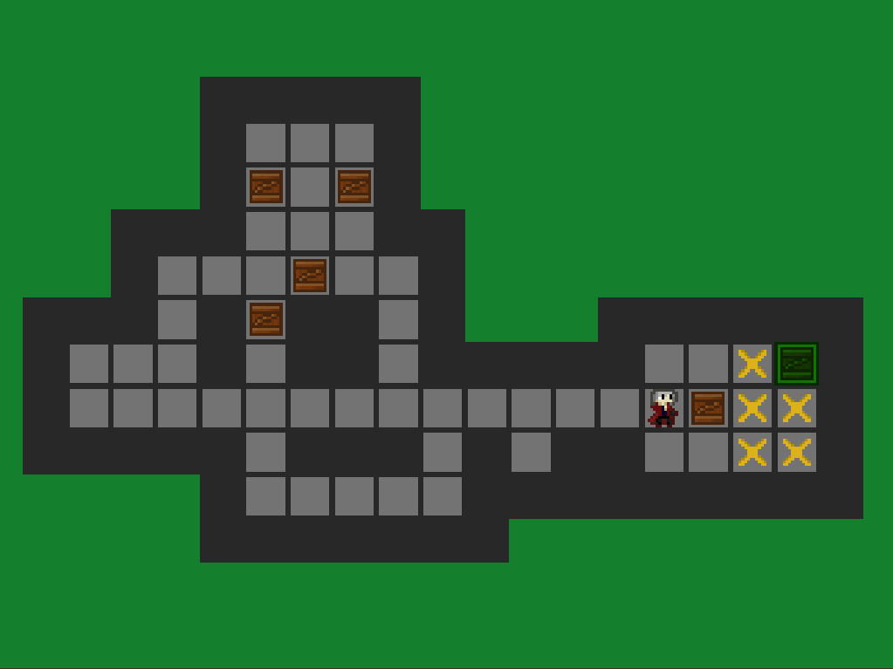

# Sokoban - popular puzzle game
Game using C# and Unity

Movement script contains functions responsible for player movement. Player can move if place is free or on this place is box, which can be pushed to free place behind.

BoxAndDestination script contains functions responsible for coloring boxes to green if set on destination place. If all the boxes are set in the correct place, the caption "You win" change visibility.

### Thanks for reading ^^

